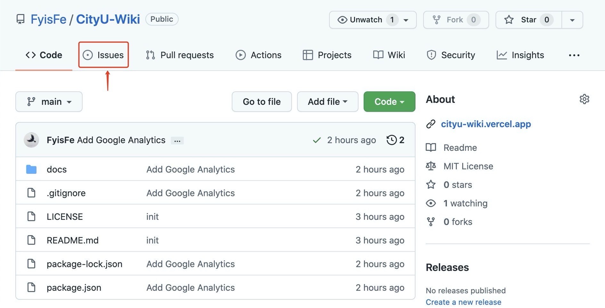
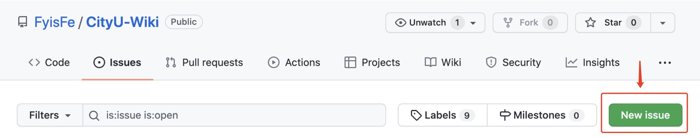
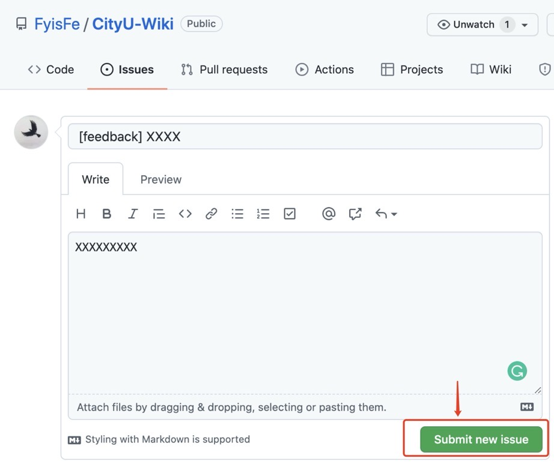
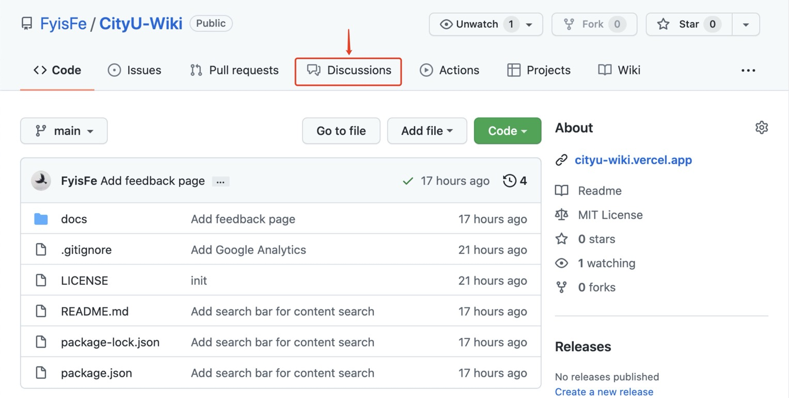
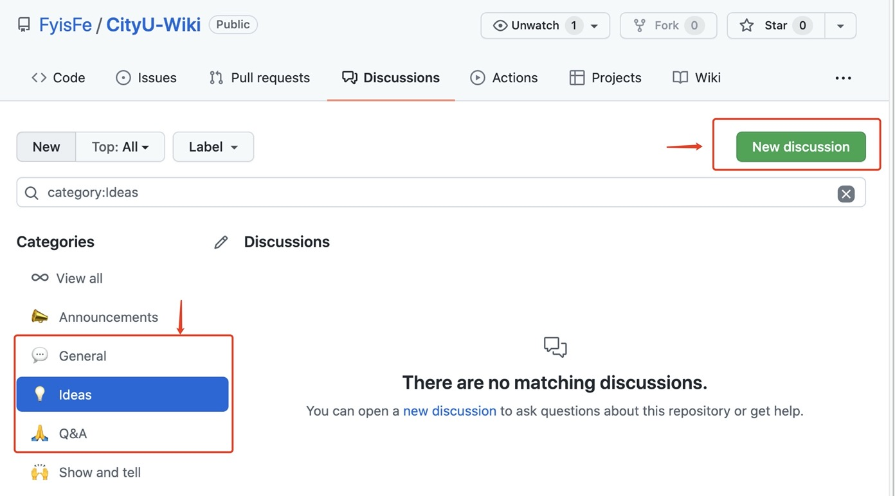

# 意见反馈

## 发现 Bug :red_circle:

如果你发现了网站的 bug，请使用一下两种方法进行反馈。

### 使用 GitHub Issues <Badge type="tip" text="Suggested" vertical="top" />

1. 如果已有`GitHub`账号可跳过此步。打开[GitHub](https://github.com/), 点击`Sign Up`按钮注册一个`Github`账号，选择`Free Plan`即可。
2. 点击进入[项目仓库](https://github.com/FyisFe/CityU-Wiki)，点击`Issues`按钮。 
3. 点击`New Issue`。 
4. 填写`title`、`comments`，点击`Submit new issue`。 

### 使用 Email

请将反馈信息发送至**cityuwiki AT 寄 mail DOT com**。

::: tip
请大家在邮件标题中注明`[report bug]`或`[提交bug]`等类似前缀，以便我们能够更好的处理你的意见。
:::

## 建议和疑问 :tada:

### 使用 GitHub Discussions <Badge type="tip" text="Suggested" vertical="top" />

1. 如果已有`GitHub`账号可跳过此步。打开[GitHub](https://github.com/), 点击`Sign Up`按钮注册一个`Github`账号，选择`Free Plan`即可。
2. 点击进入[项目仓库](https://github.com/FyisFe/CityU-Wiki)，点击`Discussions`按钮。 
3. 在相应的`Category`中点击`New discussion`。 

### 使用 Email

请将反馈信息发送至**cityuwiki AT 寄 mail DOT com**。

::: tip
请大家在邮件标题中注明`[建议]`或`[问题]`等类似前缀，以便我们能够更好的处理你的意见。
:::
